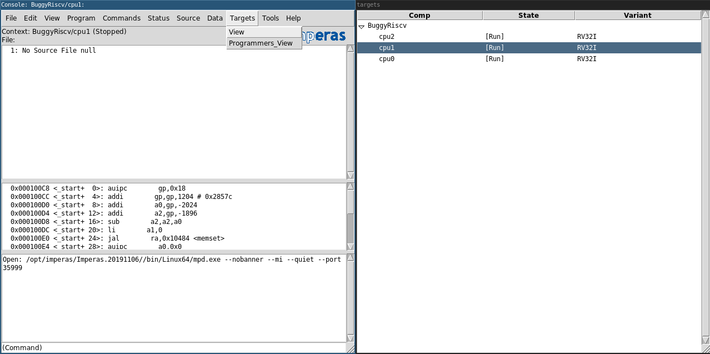
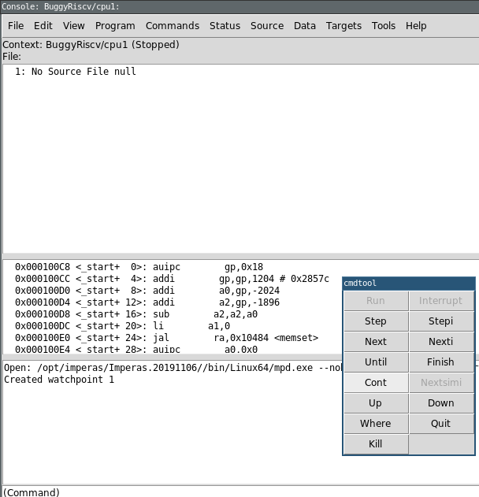
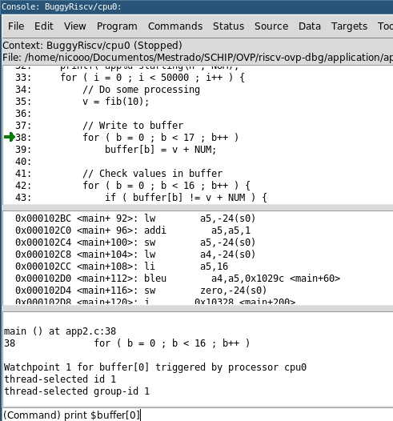

# riscv-ovp-dbg

Toy application for Imperas iGui MPD Debugger.

## Running the application

Run:
```
make run
```

Should produce the following output:

```
app3 starting
app2 starting
app1 starting
app2: buffer[0] corrupt
```

This is because the application failed to verify its values. Check [application/app2.c](application/app2.c) lines 42:47:
```
for ( b = 0 ; b < 16 ; b++ ) {
	if ( buffer[b] != v + NUM ) {
		printf("app%u: buffer[%u] corrupt\n", NUM, b);
		return 1;
	}
}
```

This means something is writing to the buffer[0] of the app2.

## Debugging the application

To debug the application with iGui tool, run:
```
make gui
```

Click Targets > View, and in the new window click the cpu1 (which is the core running the app2.c)



Add a watchpoint to buffer[0] to see when it gets modified and ignore legit access by cpu1:
```
(Command): watch buffer[0]
(Command): watchignore 1 cpu1
```

Continue execution until the watchpoint gets triggered by clicking 'Cont':



The event got triggered by cpu0 on line 38. Check that the address is being accessed by the loop iterating for one more step than it should:



